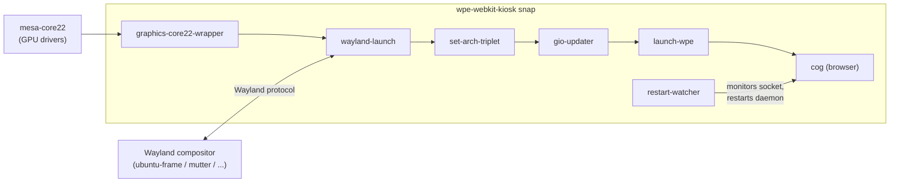
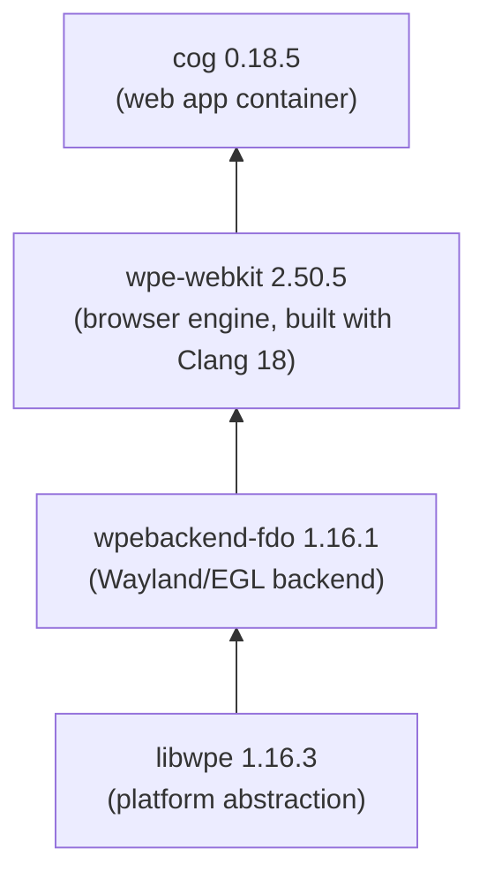

# WPE WebKit Kiosk

A [snap](https://snapcraft.io) package of [WPE WebKit](https://wpewebkit.org) for fullscreen kiosk applications. It bundles the WPE browser engine, the [Cog](https://github.com/Igalia/cog) web app container, and all required runtime libraries into a single, self-contained snap.

## Tested platforms

| Platform | Status |
|---|---|
| Ubuntu Desktop 22.04+ (Wayland session) | Supported |
| Ubuntu Core + [ubuntu-frame](https://snapcraft.io/ubuntu-frame) on Raspberry Pi 3B/3B+/4B | Supported |
| Any [snapd-supported distro](https://docs.snapcraft.io/installing-snapd/6735) with Wayland compositor | Should work |

## Architecture

### Runtime overview



The browser starts through a **command chain** -- each wrapper sets up part of the environment before passing control to the next one:

| Step | Script | Role |
|---|---|---|
| 1 | `graphics-core22-wrapper` | Configures GPU driver paths from `mesa-core22` content snap |
| 2 | `wayland-launch` | Waits for the Wayland socket, symlinks it into the snap runtime dir |
| 3 | `set-arch-triplet` | Exports `X_DEBIAN_MULTIARCH_TRIPLET` for the host CPU architecture |
| 4 | `gio-updater` | Rebuilds GIO module cache after snap refresh (needed for TLS/SSL) |
| 5 | `launch-wpe` | Reads snap config, sets env vars, launches `cog` |

### Build-time components



All four components are compiled from source in the snap build (see `snap/snapcraft.yaml`). The build order follows their dependency chain -- `libwpe` first, then `wpebackend-fdo`, `wpe-webkit`, and finally `cog`.

### Snap services

On **Ubuntu Core**, the snap runs two daemons automatically:

- **`daemon`** -- the main browser process (Cog + WPE WebKit)
- **`restart-watcher`** -- monitors `/run/user/0/wayland-0` and restarts the browser when the compositor restarts (e.g. after an `ubuntu-frame` refresh)

On **desktop systems**, daemon mode is disabled by default. You launch the browser manually with `wpe-webkit-kiosk.cog`.

## Configuration

All options are managed via `snap set` / `snap get`:

```bash
snap set wpe-webkit-kiosk url=https://example.com
snap get wpe-webkit-kiosk url
```

| Option | Default | Description |
|---|---|---|
| `url` | `https://wpewebkit.org` | Page to display. Must start with `http://` or `https://` |
| `devmode` | `false` | Enable WebKit Remote Inspector |
| `debug` | `false` | Enable verbose debug logging (GLib, Wayland, libwpe, WebKit FPS) |
| `error-to-console` | `false` | Log JavaScript errors to the service log |
| `bg-color` | `black` | Default background color while loading |
| `inspector-server-port` | `8080` | Remote Inspector port (`inspector://<host>:<port>`) |
| `inspector-http-server-port` | `8090` | HTTP Inspector port (`http://<host>:<port>`) |
| `daemon` | auto-detected | `true` on Ubuntu Core, `false` on desktop. Controls whether the browser runs as a service |

### Remote Inspector

When `devmode=true`, two inspector endpoints are available:

- **Inspector protocol** at `inspector://<ip>:8080` -- works with WebKitGTK-based browsers
- **HTTP inspector** at `http://<ip>:8090` -- works in any modern browser

### D-Bus control

The snap exposes `com.igalia.Cog` on the **system** D-Bus. Other snaps can plug this interface to remote-control the browser (navigate, reload, etc.) using the full [cogctl](https://github.com/Igalia/cog) command set.

## Hardware acceleration

```bash
snap install mesa-core22
snap connect wpe-webkit-kiosk:graphics-core22 mesa-core22:graphics-core22
```

For vendor-specific GPU drivers:

```bash
snap connect wpe-webkit-kiosk:graphics-core22 vendor-mesa-core22:graphics-core22
```

## Usage

### Desktop (windowed mode)

```bash
wpe-webkit-kiosk.cog
```

To set the window size:

```bash
export COG_PLATFORM_WL_VIEW_WIDTH=1280
export COG_PLATFORM_WL_VIEW_HEIGHT=720
wpe-webkit-kiosk.cog
```

### Ubuntu Core (daemon mode)

The browser starts automatically after installation. Use snap configuration to control it:

```bash
snap set wpe-webkit-kiosk url=https://example.com
snap logs wpe-webkit-kiosk.daemon
```

### Clear cache

```bash
wpe-webkit-kiosk.clear-cache
```

This removes cached data and restarts the browser.

### List available web settings

```bash
wpe-webkit-kiosk.list-websettings
```

## Building

### Prerequisites

- [snapcraft](https://snapcraft.io/snapcraft) (`snap install snapcraft --classic`)
- [LXD](https://snapcraft.io/lxd) (`snap install lxd && lxd init --auto`)

### Build

```bash
snapcraft
```

This creates a `.snap` file for the host architecture. The build compiles WPE WebKit from source, which is resource-intensive.

### Install locally

```bash
snap install wpe-webkit-kiosk_*.snap --dangerous
```

## Project structure

```
.
├── snap/
│   ├── snapcraft.yaml          # Snap build recipe
│   └── hooks/
│       ├── install              # Auto-detects daemon mode on first install
│       ├── post-refresh         # Re-evaluates daemon mode after snap update
│       └── configure            # Validates config, manages daemon lifecycle
├── src/
│   ├── launcher/
│   │   ├── launch-wpe           # Main entry point -- reads config, launches cog
│   │   ├── set-arch-triplet     # Exports Debian multiarch triplet
│   │   ├── gio-updater          # Rebuilds GIO module cache per revision
│   │   ├── _configure-daemon    # Detects Ubuntu Core vs desktop
│   │   └── clear-cache          # Wipes cache and restarts browser
│   └── watcher/
│       └── watcher              # Monitors Wayland socket, restarts daemon
├── wayland-launch/
│   └── bin/
│       ├── wayland-launch       # Waits for Wayland socket, sets up symlinks
│       └── setup.sh             # Helper for connecting snap interfaces
├── Dockerfile.build             # Alternative Docker-based build environment
└── LICENSE                      # MIT
```

## Multi-display setup

To span the browser across multiple displays, configure `ubuntu-frame` to present them as a single logical display. See the [ubuntu-frame documentation](https://mir-server.io/docs/display-configuration) for details.

## Environment variables

The [Cog Wayland platform plugin](https://igalia.github.io/cog/platform-wl.html) accepts additional environment variables for fine-tuning the Wayland integration.

## Releasing

Push a version tag to trigger an automatic build and publish to the Snap Store **edge** channel:

```bash
git tag v2.50.5
git push origin v2.50.5
```

The GitHub Actions workflow builds the snap for amd64 and uploads it to `edge`. To promote to stable:

```bash
snapcraft promote wpe-webkit-kiosk --from-channel=edge --to-channel=stable
```

### Prerequisites

The repository requires a `SNAPCRAFT_STORE_CREDENTIALS` secret containing a Snapcraft login token:

```bash
snapcraft export-login credentials.txt --snaps=wpe-webkit-kiosk --channels=edge --acls=package_upload
```

Add the file contents as a repository secret in GitHub (Settings → Secrets and variables → Actions).

## License

MIT
