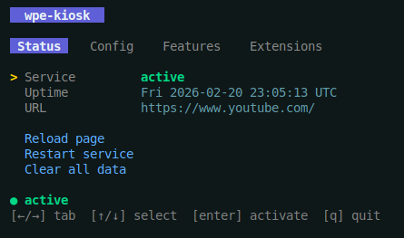
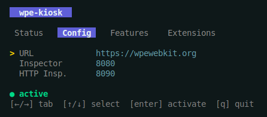
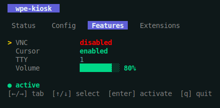
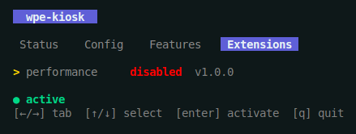
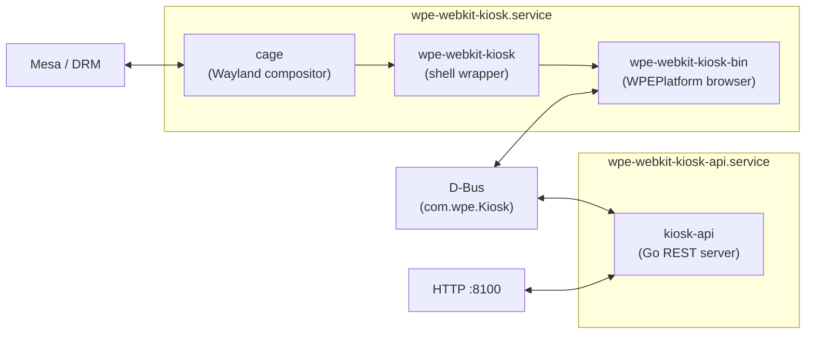
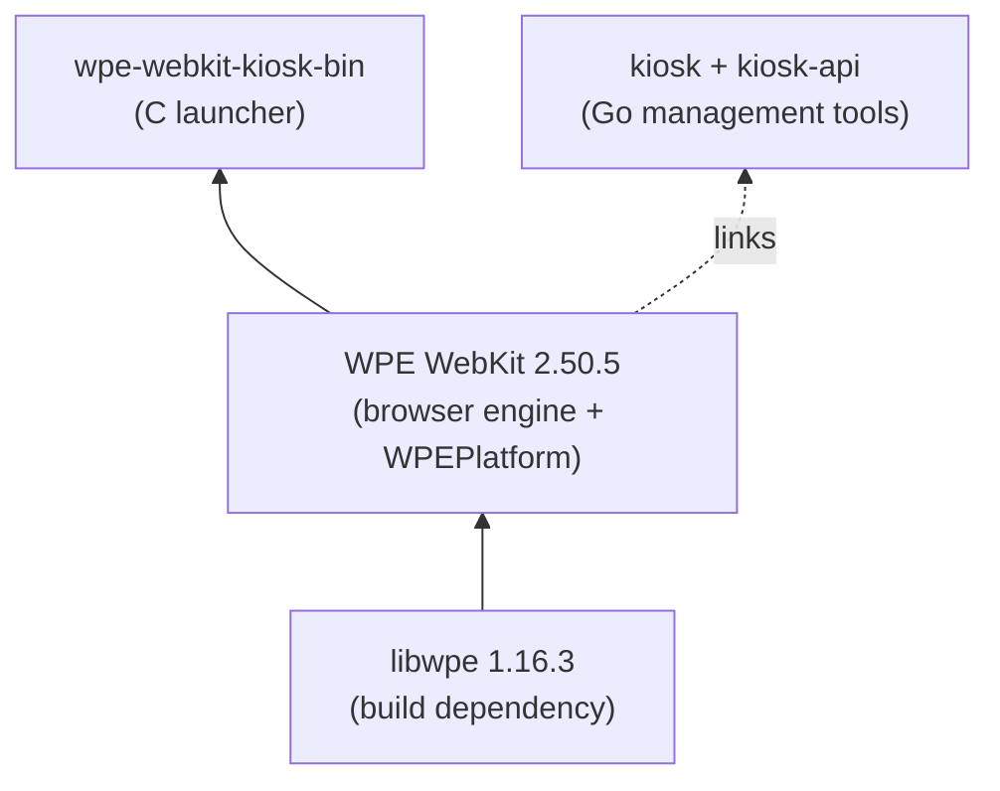

# WPE WebKit Kiosk

A `.deb` package that turns any Ubuntu machine into a fullscreen web kiosk. Built on [WPE WebKit](https://wpewebkit.org) with the modern WPEPlatform API and `linux-dmabuf` buffer sharing -- no dependency on deprecated EGL extensions.

Comes with a terminal dashboard (`kiosk`), a REST API for remote management, VNC remote access, a JavaScript extension system, and D-Bus control -- everything needed to deploy and manage kiosks at scale.

| Platform | Status |
|---|---|
| Ubuntu 24.04 LTS (amd64, Wayland) | Supported |

## Terminal dashboard

The `kiosk` command launches an interactive TUI for managing the kiosk directly on the machine.

| Status | Config |
|---|---|
|  |  |

| Features | Extensions |
|---|---|
|  |  |

**Tabs:** Status (service state, uptime, URL, actions) / Config (URL, inspector ports) / Features (VNC, cursor, TTY, volume) / Extensions (list, enable/disable).

Navigation: `[left/right]` switch tabs, `[up/down]` select items, `[enter]` activate, `[q]` quit.

The same commands are available as a CLI:

```bash
kiosk status              # Service state, uptime, current URL
kiosk open <url>          # Navigate to URL (saves to config)
kiosk reload              # Reload current page
kiosk url                 # Print current URL
kiosk config show         # Show all settings
kiosk config set KEY VAL  # Update a config value
kiosk extension list      # List extensions
kiosk extension enable X  # Enable extension
kiosk clear-data          # Clear cache, cookies, browsing data
kiosk volume set 80       # Set volume to 80%
kiosk logs -f             # Tail service logs
kiosk restart             # Restart kiosk service
```

## Architecture

### Runtime process tree

```
systemd
  ├─ wpe-webkit-kiosk.service
  │    └─ cage (Wayland compositor)
  │         └─ wpe-webkit-kiosk (shell wrapper -- reads config, sets env)
  │              └─ wpe-webkit-kiosk-bin (C launcher)
  │                   ├─ WPEPlatform Wayland (linux-dmabuf buffer sharing)
  │                   ├─ WPENetworkProcess (isolated network I/O)
  │                   ├─ WPEWebProcess (isolated page rendering)
  │                   └─ D-Bus (com.wpe.Kiosk)
  │
  ├─ wpe-webkit-kiosk-api.service
  │    └─ kiosk-api (Go REST server, port 8100)
  │
  └─ wpe-webkit-kiosk-vnc.service (optional)
       └─ wayvnc (Wayland-native VNC, port 5900)
```

WebKit spawns separate processes for networking and rendering. If a web page crashes, the compositor survives and the page reloads automatically.

### Runtime diagram



### Build-time dependency chain



### Technology stack

| Layer | Technology |
|---|---|
| Browser engine | WPE WebKit 2.50.5 (WPEPlatform API, linux-dmabuf) |
| Compositor | [cage](https://github.com/cage-compositor/cage) (single-app Wayland compositor) |
| Launcher | C (gcc), ~900 lines, GLib/GIO, json-glib |
| CLI / TUI | Go 1.24, [Cobra](https://github.com/spf13/cobra), [Bubbletea](https://github.com/charmbracelet/bubbletea), [Lipgloss](https://github.com/charmbracelet/lipgloss) |
| REST API | Go `net/http`, OpenAPI 3.0, Swagger UI |
| IPC | D-Bus system bus (`com.wpe.Kiosk`) |
| Audio | ALSA (`amixer`) |
| Remote access | VNC ([wayvnc](https://github.com/any1/wayvnc)) |
| Process manager | systemd (3 services) |
| Packaging | `.deb` (dpkg), Docker multi-stage build |

## Configuration

Edit `/etc/wpe-webkit-kiosk/config`:

```bash
URL="https://example.com"
INSPECTOR_PORT="8080"
INSPECTOR_HTTP_PORT="8090"
VNC_ENABLED="false"
VNC_PORT="5900"
CURSOR_VISIBLE="true"
EXTENSIONS_DIR="/opt/wpe-webkit-kiosk/extensions"
TTY="1"
API_PORT="8100"
```

| Option | Default | Description | Live apply |
|---|---|---|---|
| `URL` | `https://wpewebkit.org` | Page to display | Yes |
| `INSPECTOR_PORT` | `8080` | Remote Inspector port | No |
| `INSPECTOR_HTTP_PORT` | `8090` | HTTP Inspector port | No |
| `VNC_ENABLED` | `false` | Enable VNC remote access | No |
| `VNC_PORT` | `5900` | VNC listening port | No |
| `CURSOR_VISIBLE` | `true` | Show mouse cursor | No |
| `EXTENSIONS_DIR` | `/opt/wpe-webkit-kiosk/extensions` | Extensions path | No |
| `TTY` | `1` | Virtual terminal (1-12) | No |
| `API_PORT` | `8100` | REST API server port | No |
| `API_TOKEN` | *(generated at install)* | API authentication key | No |

After editing, restart the service:

```bash
sudo systemctl restart wpe-webkit-kiosk
```

## Remote management

### REST API

A separate systemd service (`wpe-webkit-kiosk-api`) exposes a REST API on the configured `API_PORT` (default `8100`). All endpoints require the `X-Api-Key` header.

**Base URL:** `http://<ip>:8100/wpe-webkit-kiosk/api/v1`

| Method | Endpoint | Description |
|---|---|---|
| `GET` | `/status` | Service state, current URL, uptime |
| `POST` | `/navigate` | Navigate to a URL (`{"url": "..."}`) |
| `POST` | `/reload` | Reload current page |
| `GET` | `/config` | Get all configuration values |
| `PUT` | `/config` | Set a config value (`{"key": "...", "value": "..."}`) |
| `POST` | `/clear` | Clear browsing data (`{"scope": "cache\|cookies\|all"}`) |
| `GET` | `/extensions` | List installed extensions |
| `POST` | `/extensions/{name}/enable` | Enable an extension |
| `POST` | `/extensions/{name}/disable` | Disable an extension |
| `POST` | `/restart` | Restart kiosk service |
| `GET` | `/system` | System telemetry (CPU, memory, disk, network, temperature) |

**Swagger UI** is available at `http://<ip>:8100/wpe-webkit-kiosk/api/v1/docs` (no authentication required).

```bash
# Get kiosk status
curl -H "X-Api-Key: $TOKEN" http://<ip>:8100/wpe-webkit-kiosk/api/v1/status

# Navigate to a URL
curl -X POST -H "X-Api-Key: $TOKEN" -H "Content-Type: application/json" \
  -d '{"url": "https://example.com"}' \
  http://<ip>:8100/wpe-webkit-kiosk/api/v1/navigate

# Get system telemetry
curl -H "X-Api-Key: $TOKEN" http://<ip>:8100/wpe-webkit-kiosk/api/v1/system
```

All responses use a consistent JSON envelope:

```json
{"data": { ... }, "error": null}
{"data": null, "error": {"code": "unauthorized", "message": "Invalid API key"}}
```

**Token management:**

```bash
kiosk api token show         # Show current token
kiosk api token regenerate   # Regenerate (restarts API service)
kiosk api status             # Check API service status
```

### D-Bus interface

The kiosk exposes `com.wpe.Kiosk` on the system D-Bus:

```bash
# Navigate
sudo dbus-send --system --print-reply --dest=com.wpe.Kiosk / com.wpe.Kiosk.Open string:'https://example.com'

# Get current URL
sudo dbus-send --system --print-reply --dest=com.wpe.Kiosk / com.wpe.Kiosk.GetUrl

# Reload
sudo dbus-send --system --print-reply --dest=com.wpe.Kiosk / com.wpe.Kiosk.Reload
```

### Remote Inspector

Always enabled:

- **Inspector protocol:** `inspector://<ip>:8080`
- **HTTP inspector:** `http://<ip>:8090`

### VNC

When `VNC_ENABLED=true`, a Wayland-native VNC server (`wayvnc`) runs on the configured port (default `5900`). Connect with any VNC client.

## Extensions

JavaScript extensions are loaded from `EXTENSIONS_DIR` (default `/opt/wpe-webkit-kiosk/extensions`). Each extension is a directory containing a `manifest.json`:

```
extensions/performance/
├── manifest.json       # {"name", "version", "description", "scripts", "styles"}
├── performance.js      # Injected into WebKit context
└── performance.css     # Injected styles
```

Manage extensions via TUI (Extensions tab), CLI (`kiosk extension list/enable/disable`), or REST API.

## Installation

### Install via APT (recommended)

Add the repository and install:

```bash
# Add GPG key
curl -fsSL https://tomasz-mizak.github.io/wpe-webkit-kiosk/gpg.key \
  | sudo gpg --dearmor -o /usr/share/keyrings/wpe-kiosk.gpg

# Add repository
echo "deb [signed-by=/usr/share/keyrings/wpe-kiosk.gpg] https://tomasz-mizak.github.io/wpe-webkit-kiosk stable main" \
  | sudo tee /etc/apt/sources.list.d/wpe-kiosk.list

# Install
sudo apt update
sudo apt install cage wpe-webkit-kiosk
```

Updates are delivered automatically via `apt upgrade`.

### Install from .deb (manual)

Download the `.deb` from [GitHub Releases](https://github.com/tomasz-mizak/wpe-webkit-kiosk/releases) and install manually:

```bash
sudo apt install cage
sudo dpkg -i wpe-webkit-kiosk_<version>_amd64.deb
```

### Enable and verify

```bash
sudo systemctl daemon-reload
sudo systemctl enable --now wpe-webkit-kiosk
sudo systemctl status wpe-webkit-kiosk
sudo journalctl -u wpe-webkit-kiosk -f
```

## Building

Requires Docker. The first build compiles WPE WebKit from source (~1h). Subsequent builds reuse the cached WebKit layer and only recompile the launcher and Go tools.

```bash
make deb                    # Dev build → output/wpe-webkit-kiosk_0.0.0-dev_amd64.deb
make deb VERSION=1.0.0      # Versioned build
make clean                  # Remove build artifacts
```

## Releasing

The project uses [semantic versioning](https://semver.org/) and [conventional commits](https://www.conventionalcommits.org/). Releases are automated via GitHub Actions.

```bash
git tag v1.0.0
git push --tags
```

GitHub Actions builds the `.deb`, generates a changelog with [git-cliff](https://git-cliff.org/), and creates a GitHub Release with the package attached.

| Prefix | Changelog section | Semver bump |
|---|---|---|
| `feat:` | Features | minor |
| `fix:` | Bug Fixes | patch |
| `perf:` | Performance | patch |
| `docs:` | Documentation | -- |
| `refactor:` | Refactoring | -- |
| `chore:` / `ci:` / `build:` | Miscellaneous | -- |

Breaking changes (`feat!:`, `fix!:`, etc.) require a major version bump.

## Project structure

```
.
├── Dockerfile                         # Multi-stage Docker build (base → webkit → final)
├── Makefile                           # Top-level build: make deb
├── build.mk                          # Inner Makefile: launcher, CLI, API, .deb packaging
├── webkit.mk                         # WebKit + libwpe compilation rules
├── src/
│   └── kiosk.c                       # C launcher: WebKit + D-Bus + extension loader
├── cmd/kiosk/
│   ├── main.go                       # CLI/TUI entry point (kiosk binary)
│   ├── cmd_*.go                      # CLI commands (status, open, config, volume, etc.)
│   ├── cmd/api/main.go               # REST API entry point (kiosk-api binary)
│   └── internal/
│       ├── api/                      # REST API (server, routes, handlers, auth, docs)
│       ├── config/                   # Config file parser (shared)
│       ├── dbus/                     # D-Bus client (shared)
│       ├── audio/                    # ALSA volume control
│       └── tui/                      # Bubbletea terminal dashboard
├── extensions/
│   └── performance/                  # Built-in performance overlay extension
├── doc/
│   └── api/openapi.yaml              # OpenAPI 3.0 specification
├── debian/
│   ├── control                       # Package metadata and dependencies
│   ├── config                        # Default kiosk configuration
│   ├── postinst                      # Post-install (ALSA defaults, API token generation)
│   ├── prerm                         # Pre-remove cleanup
│   ├── sudoers                       # Sudo rules for privileged operations
│   ├── wpe-webkit-kiosk              # Shell wrapper (reads config, sets env)
│   ├── kiosk-start                   # Systemd ExecStart (cage + wrapper)
│   ├── wpe-webkit-kiosk.service      # Main service (cage + kiosk)
│   ├── wpe-webkit-kiosk-api.service  # REST API service
│   ├── wpe-webkit-kiosk-vnc.service  # VNC service (optional)
│   ├── wpe-webkit-kiosk-vnc-check    # VNC availability check
│   └── com.wpe.Kiosk.conf            # D-Bus policy for system bus
└── .github/workflows/                # Release pipeline (tag → build → publish)
```

## License

MIT
