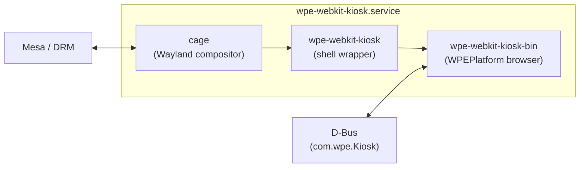
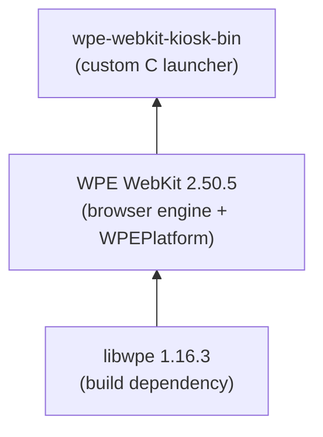

# WPE WebKit Kiosk

A `.deb` package of [WPE WebKit](https://wpewebkit.org) for fullscreen kiosk applications on Ubuntu. Uses the modern [WPEPlatform API](https://wpewebkit.org) with `linux-dmabuf` buffer sharing -- no dependency on deprecated EGL extensions.

## Tested platforms

| Platform | Status |
|---|---|
| Ubuntu 24.04 LTS (amd64, Wayland) | Supported |

## Technology stack

### WebKit

The browser engine -- the same core that powers Safari. It parses HTML/CSS, executes JavaScript, and renders web pages. There are three major "ports" of WebKit:

- **Apple WebKit** -- Safari on macOS/iOS
- **WebKitGTK** -- for GNOME desktop apps (e.g. Epiphany)
- **WPE WebKit** -- for embedded/kiosk devices (this project)

### WPE (Web Platform for Embedded)

A WebKit port optimized for devices without a full desktop environment -- set-top boxes, kiosks, in-vehicle infotainment. Developed by [Igalia](https://igalia.com). Unlike WebKitGTK, it does not require GTK or a desktop stack -- it renders directly through EGL/DRM.

### libwpe

A small library (~200KB) that defines the platform abstraction for WPE WebKit. WebKit compiles against it to communicate with the graphics system. In our build it is purely a build-time dependency -- WebKit will not compile without it, but at runtime it has no active role.

### WPEPlatform API

A built-in mechanism (since WebKit 2.44+) for connecting WebKit to Wayland. It uses the `linux-dmabuf` protocol for GPU buffer sharing, which is the modern standard supported by all current Mesa versions. This replaces the older `wpebackend-fdo` + `Cog` stack, which depended on an EGL extension (`eglCreateWaylandBufferFromImageWL`) that Mesa 25.2+ removed.

### cage (Wayland compositor)

A Wayland compositor takes pixel buffers from applications, arranges them on screen (position, size, z-order), optionally adds effects (shadows, transparency), and sends the final composited image to the display. Think of it as a video editor that layers multiple sources into one output frame.

[cage](https://github.com/cage-compositor/cage) is the simplest possible compositor -- it takes one application, stretches it fullscreen, and that's it. No window decorations, no taskbar, no effects. This makes it ideal for kiosk use.

### wpe-webkit-kiosk-bin (src/kiosk.c)

Our custom launcher -- ~150 lines of C. It creates a `WebKitWebView` using the WPEPlatform API, sets it to fullscreen, loads the configured URL, and exposes a D-Bus interface (`com.wpe.Kiosk`) on the system bus for remote control (navigate, reload, get current URL).

### wpe-webkit-kiosk (shell wrapper)

A bash script that reads `/etc/wpe-webkit-kiosk/config`, sets up `LD_LIBRARY_PATH` (because WebKit is installed in `/opt/wpe-webkit-kiosk`, not in system library paths), configures the Remote Inspector, and executes `wpe-webkit-kiosk-bin`.

## Architecture

### Runtime process tree

```
systemd
  └─ cage (Wayland compositor -- provides the display)
       └─ wpe-webkit-kiosk (wrapper -- reads config, sets environment)
            └─ wpe-webkit-kiosk-bin (our C launcher)
                 ├─ WPEPlatform Wayland (connects rendering to cage via linux-dmabuf)
                 ├─ WPENetworkProcess (isolated process for network requests)
                 ├─ WPEWebProcess (isolated process for page rendering)
                 └─ D-Bus (com.wpe.Kiosk -- remote control interface)
```

WebKit intentionally spawns separate processes for networking and rendering. If a web page crashes, the main process and the compositor survive and reload the page automatically.

### Runtime diagram



### Build-time dependency chain



WebKit is compiled with `ENABLE_WPE_PLATFORM=ON` and `ENABLE_WPE_PLATFORM_WAYLAND=ON`, providing built-in Wayland support via the `linux-dmabuf` protocol.

## Configuration

Edit `/etc/wpe-webkit-kiosk/config`:

```bash
URL="https://example.com"
INSPECTOR_PORT="8080"
INSPECTOR_HTTP_PORT="8090"
VNC_ENABLED="false"
VNC_PORT="5900"
CURSOR_VISIBLE="true"
EXTENSIONS_DIR="/opt/wpe-webkit-kiosk/extensions"
TTY="1"
API_PORT="8100"
```

| Option | Default | Description | Live apply |
|---|---|---|---|
| `URL` | `https://wpewebkit.org` | Page to display | Yes |
| `INSPECTOR_PORT` | `8080` | Remote Inspector port | No |
| `INSPECTOR_HTTP_PORT` | `8090` | HTTP Inspector port | No |
| `VNC_ENABLED` | `false` | Enable VNC remote access | No |
| `VNC_PORT` | `5900` | VNC listening port | No |
| `CURSOR_VISIBLE` | `true` | Show mouse cursor | No |
| `EXTENSIONS_DIR` | `/opt/wpe-webkit-kiosk/extensions` | Extensions path | No |
| `TTY` | `1` | Virtual terminal (1-12) | No |
| `API_PORT` | `8100` | REST API server port | No |
| `API_TOKEN` | *(generated at install)* | API authentication key | No |

After editing, restart the service:

```bash
sudo systemctl restart wpe-webkit-kiosk
```

### Remote Inspector

The Remote Inspector is always enabled. Two endpoints are available:

- **Inspector protocol** at `inspector://<ip>:8080`
- **HTTP inspector** at `http://<ip>:8090`

### D-Bus control

The kiosk exposes `com.wpe.Kiosk` on the **system** D-Bus:

```bash
# Navigate to a URL
sudo dbus-send --system --print-reply --dest=com.wpe.Kiosk / com.wpe.Kiosk.Open string:'https://example.com'

# Get current URL
sudo dbus-send --system --print-reply --dest=com.wpe.Kiosk / com.wpe.Kiosk.GetUrl

# Reload page
sudo dbus-send --system --print-reply --dest=com.wpe.Kiosk / com.wpe.Kiosk.Reload
```

### REST API

The kiosk includes a REST API server for remote management over HTTP. It runs as a separate systemd service (`wpe-webkit-kiosk-api`) on the configured `API_PORT` (default `8100`).

All endpoints require the `X-Api-Key` header with the token from the config file. A token is generated automatically during package installation.

**Base URL:** `http://<ip>:8100/wpe-webkit-kiosk/api/v1`

| Method | Endpoint | Description |
|---|---|---|
| `GET` | `/status` | Service state, current URL, uptime |
| `POST` | `/navigate` | Navigate to a URL (`{"url": "..."}`) |
| `POST` | `/reload` | Reload current page |
| `GET` | `/config` | Get all configuration values |
| `PUT` | `/config` | Set a config value (`{"key": "...", "value": "..."}`) |
| `POST` | `/clear` | Clear browsing data (`{"scope": "cache\|cookies\|all"}`) |
| `GET` | `/extensions` | List installed extensions |
| `POST` | `/extensions/{name}/enable` | Enable an extension |
| `POST` | `/extensions/{name}/disable` | Disable an extension |
| `POST` | `/restart` | Restart kiosk service |
| `GET` | `/system` | System telemetry (CPU, memory, disk, network, temperature) |

**Swagger UI** is available at `http://<ip>:8100/wpe-webkit-kiosk/api/v1/docs` (no authentication required).

#### Examples

```bash
# Get kiosk status
curl -H "X-Api-Key: $TOKEN" http://192.168.18.37:8100/wpe-webkit-kiosk/api/v1/status

# Navigate to a URL
curl -X POST -H "X-Api-Key: $TOKEN" -H "Content-Type: application/json" \
  -d '{"url": "https://example.com"}' \
  http://192.168.18.37:8100/wpe-webkit-kiosk/api/v1/navigate

# Get system info
curl -H "X-Api-Key: $TOKEN" http://192.168.18.37:8100/wpe-webkit-kiosk/api/v1/system
```

All responses follow a consistent JSON envelope:

```json
{"data": { ... }, "error": null}
{"data": null, "error": {"code": "unauthorized", "message": "Invalid API key"}}
```

#### API token management

```bash
# Show current token
kiosk api token show

# Regenerate token (restarts API service automatically)
kiosk api token regenerate

# Check API service status
kiosk api status
```

## Installation

### Prerequisites

The target system needs [cage](https://github.com/cage-compositor/cage) installed:

```bash
sudo apt install cage
```

### Install the package

```bash
sudo dpkg -i wpe-webkit-kiosk_2.50.5_amd64.deb
```

### Enable and start

```bash
sudo systemctl daemon-reload
sudo systemctl enable --now wpe-webkit-kiosk
```

### Check status

```bash
sudo systemctl status wpe-webkit-kiosk
sudo journalctl -u wpe-webkit-kiosk -f
```

## Building

### Prerequisites

- Docker

### Build

```bash
make deb
```

This produces `output/wpe-webkit-kiosk_2.50.5_amd64.deb`. The first build compiles WPE WebKit from source inside Docker (~1h). Subsequent builds reuse the cached WebKit layer and only recompile the launcher.

### Clean

```bash
make clean
```

## Project structure

```
.
├── Dockerfile                  # Multi-stage Docker build (WebKit cached)
├── Makefile                    # Top-level build: `make deb`
├── build.mk                   # Inner Makefile: libwpe, WebKit, launcher, API
├── src/
│   └── kiosk.c                # WPEPlatform launcher with D-Bus interface
├── cmd/kiosk/                  # Go management tools
│   ├── main.go                # CLI/TUI entry point (`kiosk` binary)
│   ├── cmd/api/main.go        # REST API server entry point (`kiosk-api` binary)
│   ├── internal/api/          # API server (handlers, auth, routes, docs)
│   ├── internal/config/       # Config file parser (shared)
│   ├── internal/dbus/         # D-Bus client (shared)
│   └── internal/tui/          # Terminal UI dashboard
├── doc/api/
│   └── openapi.yaml           # OpenAPI 3.0 specification
├── extensions/                 # Built-in JS extensions
└── debian/
    ├── control                 # Package metadata and dependencies
    ├── config                  # Default kiosk configuration
    ├── postinst                # Post-install (ALSA defaults, API token)
    ├── wpe-webkit-kiosk               # Shell wrapper (reads config, sets env)
    ├── wpe-webkit-kiosk.service       # systemd unit (cage + kiosk)
    ├── wpe-webkit-kiosk-api.service   # systemd unit (REST API server)
    ├── wpe-webkit-kiosk-vnc.service   # systemd unit (VNC, optional)
    └── com.wpe.Kiosk.conf      # D-Bus policy for system bus
```

## License

MIT
