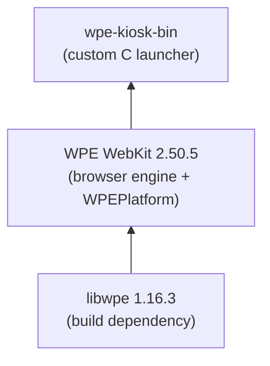

# WPE WebKit Kiosk

A `.deb` package of [WPE WebKit](https://wpewebkit.org) for fullscreen kiosk applications on Ubuntu. Uses the modern [WPEPlatform API](https://wpewebkit.org) with `linux-dmabuf` buffer sharing -- no dependency on deprecated EGL extensions.

## Tested platforms

| Platform | Status |
|---|---|
| Ubuntu 24.04 LTS (amd64, Wayland) | Supported |

## Architecture

### Runtime overview


The systemd service starts [cage](https://github.com/cage-compositor/cage) (a minimal Wayland compositor for kiosk mode), which launches the wrapper script. The wrapper reads `/etc/wpe-kiosk/config`, sets up library paths, and executes `wpe-kiosk-bin`.

### Build-time components



WebKit is compiled with `ENABLE_WPE_PLATFORM=ON` and `ENABLE_WPE_PLATFORM_WAYLAND=ON`, providing built-in Wayland support via the `linux-dmabuf` protocol.

## Configuration

Edit `/etc/wpe-kiosk/config`:

```bash
URL="https://example.com"
INSPECTOR_PORT="8080"
INSPECTOR_HTTP_PORT="8090"
```

| Option | Default | Description |
|---|---|---|
| `URL` | `https://wpewebkit.org` | Page to display |
| `INSPECTOR_PORT` | `8080` | Remote Inspector port |
| `INSPECTOR_HTTP_PORT` | `8090` | HTTP Inspector port |

After editing, restart the service:

```bash
sudo systemctl restart wpe-kiosk
```

### Remote Inspector

The Remote Inspector is always enabled. Two endpoints are available:

- **Inspector protocol** at `inspector://<ip>:8080`
- **HTTP inspector** at `http://<ip>:8090`

### D-Bus control

The kiosk exposes `com.wpe.Kiosk` on the **system** D-Bus:

```bash
# Navigate to a URL
sudo dbus-send --system --print-reply --dest=com.wpe.Kiosk / com.wpe.Kiosk.Open string:'https://example.com'

# Get current URL
sudo dbus-send --system --print-reply --dest=com.wpe.Kiosk / com.wpe.Kiosk.GetUrl

# Reload page
sudo dbus-send --system --print-reply --dest=com.wpe.Kiosk / com.wpe.Kiosk.Reload
```

## Installation

### Prerequisites

The target system needs [cage](https://github.com/cage-compositor/cage) installed:

```bash
sudo apt install cage
```

### Install the package

```bash
sudo dpkg -i wpe-kiosk_2.50.5_amd64.deb
```

### Enable and start

```bash
sudo systemctl daemon-reload
sudo systemctl enable --now wpe-kiosk
```

### Check status

```bash
sudo systemctl status wpe-kiosk
sudo journalctl -u wpe-kiosk -f
```

## Building

### Prerequisites

- Docker

### Build

```bash
make deb
```

This produces `output/wpe-kiosk_2.50.5_amd64.deb`. The first build compiles WPE WebKit from source inside Docker (~1h). Subsequent builds reuse the cached WebKit layer and only recompile the launcher.

### Clean

```bash
make clean
```

## Project structure

```
.
├── Dockerfile                  # Multi-stage Docker build (WebKit cached)
├── Makefile                    # Top-level build: `make deb`
├── build.mk                   # Inner Makefile: libwpe, WebKit, launcher
├── src/
│   └── kiosk.c                # WPEPlatform launcher with D-Bus interface
└── debian/
    ├── control                 # Package metadata and dependencies
    ├── config                  # Default kiosk configuration
    ├── wpe-kiosk               # Shell wrapper (reads config, sets env)
    ├── wpe-kiosk.service       # systemd unit (cage + wpe-kiosk)
    └── com.wpe.Kiosk.conf      # D-Bus policy for system bus
```

## License

MIT
